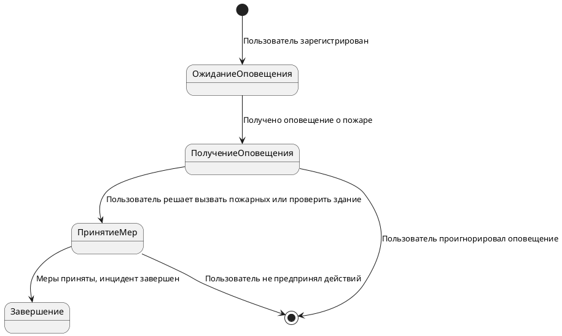

# Диаграммы состояний

## Урок 1. Основы диаграмм состояний

> **Задание:**
> Опишите диаграмму состояния оператора центра оповещения. Кейс прикреплен в материалах к семинару: ИТ решение для города Х.
>

## Урок 2. Конечные автоматы

| **Состояние** | **Событие** | **Действие** | **Следующее состояние** |
| --- | --- | --- | --- |
| Ожидание | Обнружен дым/температура | Отправить сигнал в центр управления | Обнаружение |
| Обнаружение | Сигнал отправлен | Ожидать подтверждения от центра | Ожидание подтверждения |
| Ожидание подтверждения | Подтверждение получено | Подтвердить наличие пожара, уведомить пользователей | Подтверждено |
| Ожидание подтверждения | Подтверждение не получено | Сигнал ложный, возврат к ожиданию | Ожидание |
| Подтверждено | Пожар устранен | Сброс состояния датчиков | Сброс |
| Сброс | - | Переключиться в режим ожидания | Ожидание |

## Урок 3. Моделирование жизненного цикла объекта и введение в UML

